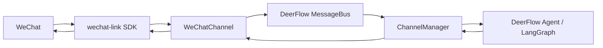

# DeerFlow WeChat

<div align="center">


[](https://github.com/syusama/deer-flow-wechat)

**让 DeerFlow 直接接入微信。**

扫码登录，少量配置，直接在微信里和你的 Agent 对话。  
不额外搭一套机器人平台，不绕一层复杂桥接服务，也不用先研究一堆协议细节。

[快速开始](#快速开始) · [为什么它更省事](#为什么它更省事) · [微信接入步骤](#微信接入步骤) · [仓库结构](#仓库结构)

</div>

---

## 这是什么

`deer-flow-wechat` 是一个面向实际可用性的集成仓库：它把 **DeerFlow 2** 的 Agent 能力和 **wechat-link** 的微信接入能力组合到一起，让你可以用最短路径把 DeerFlow 放进微信。

这个仓库的核心目标不是“做一个更重的平台”，而是把事情做简单：

- 让 DeerFlow 保持原有架构和工作流
- 让微信接入尽量低侵入、低配置、低心智负担
- 让你先跑起来，再决定要不要继续深度定制

如果你想要的是：

- 在微信里直接和 DeerFlow 对话
- 扫码登录一次后持续使用
- 复用 DeerFlow 现有的线程、命令、产物回传能力
- 尽量少改动现有系统

这个仓库就是为这个场景准备的。

## 为什么它更省事

很多“接微信”的方案，真正麻烦的地方并不是发出第一条消息，而是后面的维护成本：

- 要不要单独搭一个桥接服务
- 登录态怎么保存
- 长轮询游标怎么持久化
- 回复上下文怎么关联
- 图片和文件怎么回传
- 已有 Agent 系统怎么最小代价接进去

这个仓库已经把这些工程细节压缩进现有实现里，默认走一条更直接的路径：

| 你通常会遇到的问题 | 这个仓库怎么处理 |
| --- | --- |
| 还要单独造一层微信机器人平台 | 不需要，直接在 DeerFlow 内部启用 `WeChatChannel` |
| 登录流程容易散落在脚本里 | 提供扫码登录 CLI，直接生成 session 文件 |
| 服务重启后容易重复收旧消息 | 使用持久化 `cursor_file` 保存长轮询游标 |
| 微信回复依赖上下文，接起来麻烦 | 通道内处理 `context_token` 关联 |
| Agent 生成的图片和文件不好回微信 | 已支持图片和普通文件回传 |
| 改动太大，不利于后续维护 | 保持 DeerFlow 主体结构不变，微信能力边界清晰 |

一句话概括：

> **它追求的不是“功能看起来很多”，而是“接入真的简单，跑起来真的省事”。**

## 当前能力

仓库当前已经覆盖一条可用的微信接入链路：

- 微信扫码登录并保存 session
- 基于 `wechat-link` 的长轮询收消息
- 文本消息入站和出站
- DeerFlow 渠道命令复用
- 图片和普通文件产物回传
- `class_path` 动态加载能力，便于继续插件化演进

当前更适合的目标是：

- 个人使用
- 内部工具接入
- Agent / Workflow 验证
- 快速做出可演示、可迭代的微信版入口

## 工作方式



这条链路的重点是：**微信只是 DeerFlow 的一个通道，不是另起一套系统。**

## 快速开始

### 1. 克隆仓库

```bash
git clone https://github.com/syusama/deer-flow-wechat.git
cd deer-flow-wechat/deer-flow
```

### 2. 准备基础配置

```bash
make config
```

这一步会基于模板生成本地 `config.yaml`。

### 3. 安装依赖

```bash
make install
```

如果你是在 Windows 上本地开发，建议在带有 `make` / Git Bash 的环境中执行。  
如果你更偏向容器化流程，也可以直接使用 DeerFlow 自带的 Docker 启动方式。

### 4. 配置模型与环境变量

至少完成两件事：

- 在 `config.yaml` 中配置 DeerFlow 要使用的模型
- 在 `.env` 中填入对应的 API Key

模型配置模板可直接参考：

- [`deer-flow/config.example.yaml`](./deer-flow/config.example.yaml)

### 5. 启用微信通道

在 `config.yaml` 的 `channels` 下启用 `wechat`：

```yaml
channels:
  wechat:
    enabled: true
    bot_token: $WECHAT_BOT_TOKEN
    base_url: https://ilinkai.weixin.qq.com
    session_file: ./.state/wechat-link-session.json
    cursor_file: ./.state/wechat-cursor.json
```

说明：

- `bot_token` 不是必须写死；如果 `session_file` 里已有可用 token，也可以直接复用
- `cursor_file` 建议持久化保存，否则重启后可能重复消费旧消息
- 如果你后续要走自定义插件类，也可以继续使用 `class_path` 机制扩展

## 微信接入步骤

这是最推荐、也最省心的一条路径。

### 第一步：扫码生成登录会话

```bash
cd backend
uv run deerflow-wechat-login --session-file ../.state/wechat-link-session.json
```

执行后会：

- 输出二维码信息
- 在终端打印二维码
- 将登录结果保存到 `session_file`

如果当前环境还没装 `uv`，也可以退回到模块方式启动：

```bash
cd backend
PYTHONPATH=. python -m app.channels.wechat_login --session-file ../.state/wechat-link-session.json
```

### 第二步：启动 DeerFlow

回到 `deer-flow/` 根目录后启动：

```bash
make dev
```

或者使用容器方式：

```bash
make docker-init
make docker-start
```

### 第三步：直接在微信里对话

服务启动后，你就可以直接在已登录的微信中和 DeerFlow 对话。

常见用法包括：

- 直接发送自然语言任务
- 使用 `/new` 开新会话
- 使用 `/status` 查看状态
- 使用 `/help` 查看命令说明
- 等 DeerFlow 产出图片、Markdown、PDF 等文件后直接回传到微信

## 推荐使用方式

如果你想最快看到结果，建议按下面的顺序来：

1. 先让 DeerFlow 在本地跑起来
2. 再启用 `channels.wechat`
3. 再用登录 CLI 生成 session
4. 最后用微信做真实对话验证

这样做的好处是：

- 问题定位更清楚
- 配置链路更短
- 更符合“先打通，再优化”的节奏

## 仓库结构

```text
deer-flow-wechat/
  deer-flow/     # 集成了 WeChatChannel 的 DeerFlow 主体
  wechat-link/   # 微信接入 SDK
  docs/          # 技术设计与补充文档
```

你可以把这个仓库理解成三个层次：

- **`deer-flow/`** 负责 Agent、Gateway、前后端、渠道管理和整体运行
- **`wechat-link/`** 负责微信登录、长轮询、消息发送、媒体上传等协议适配
- **`docs/`** 负责沉淀设计思路、能力边界和后续演进依据

如果你只关心某一层，可以直接跳到对应目录：

- DeerFlow 主体说明：[`deer-flow/README_zh.md`](./deer-flow/README_zh.md)
- wechat-link SDK 说明：[`wechat-link/README.md`](./wechat-link/README.md)
- 微信接入设计文档：[`docs/deer-flow-wechat-plugin-tech-design.md`](./docs/deer-flow-wechat-plugin-tech-design.md)

## 适合谁

这个仓库尤其适合下面几类人：

- 想把 DeerFlow 直接搬进微信的人
- 想快速验证“微信 + Agent”真实交互链路的人
- 不想先搭后台、数据库、控制台、桥接服务的人
- 想在已有 DeerFlow 基础上继续做微信能力扩展的人

如果你要的是一个重运营、重编排、重后台管理的平台，这个仓库不是那个方向。  
如果你要的是一个**尽快可用、结构清晰、便于继续演化**的微信接入方案，它是合适的。

## 安全与使用提醒

- `wechat-link` 是非官方项目，接入前请先评估你的使用场景与风险边界
- `bot_token`、session 文件和本地 `.env` 都属于敏感信息，不要提交到 Git
- `session_file` 与 `cursor_file` 建议放在 `.state/` 或独立持久化目录
- 生产部署前，建议限制日志输出和本地文件权限

## 后续开发建议

如果你准备继续把它做成更完整的微信渠道方案，推荐优先往这些方向推进：

- 更细的错误恢复和重登录机制
- 更完整的入站媒体消息处理
- 更清晰的插件包拆分与发布
- 多实例场景下的游标协调与会话管理

## 参考文档

- DeerFlow 主仓库文档：[`deer-flow/README.md`](./deer-flow/README.md)
- 中文使用文档：[`deer-flow/README_zh.md`](./deer-flow/README_zh.md)
- wechat-link SDK：[`wechat-link/README.md`](./wechat-link/README.md)
- 技术设计说明：[`docs/deer-flow-wechat-plugin-tech-design.md`](./docs/deer-flow-wechat-plugin-tech-design.md)

---

如果你想要的是一个真正能用、而不是只停留在“理论上可接”的 DeerFlow 微信入口，这个仓库的目标就一句话：

**尽量少折腾，尽快跑起来。**
