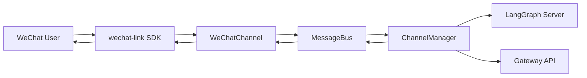

# DeerFlow 微信接入插件技术文档

## 1. 结论摘要

基于对 `deer-flow` 和 `wechat-link` 最新代码结构的研究，可以得出三个直接结论：

1. `deer-flow` 已经具备成熟的 IM 通道抽象，接入层核心是 `Channel -> MessageBus -> ChannelManager -> LangGraph`，因此“做一个微信通道”在架构上是成立的。
2. `wechat-link` 已经把微信登录、长轮询收消息、文本回复、typing、图片/文件/视频/语音发送，以及可选的 HTTP Relay 都封装出来了，足够承担底层协议适配。
3. 真正的难点不在“能不能发微信”，而在“怎样以插件形式、低侵入地接入 DeerFlow，并把微信特有的 `context_token`、长轮询游标、登录会话管理好”。

推荐方案如下：

- 推荐做法：实现一个 **原生嵌入 DeerFlow 的 `WeChatChannel` 插件包**，底层直接调用 `wechat-link` Python SDK。
- 推荐定位：先做 **MVP 文本消息版**，支持扫码登录、长轮询收消息、文本回复、`/new` `/status` `/help` 命令、基础 typing 状态、输出文件中的图片/普通文件回传。
- 推荐对 DeerFlow 的改动：只做 **一处最小核心增强**，让 ChannelService 支持按配置动态加载第三方 channel class，从而真正具备“插件化”能力。

不推荐把第一版做成“完全独立的旁路机器人桥”，因为那会绕开 DeerFlow 现有 ChannelManager、线程映射、命令处理和 artifact 回传机制，最终会变成重复造一个简化版 DeerFlow IM 层。

---

## 2. 研究对象与现状

### 2.1 DeerFlow 的 IM 接入现状

`deer-flow` 当前已经内置三个 IM 渠道：

- `FeishuChannel`
- `SlackChannel`
- `TelegramChannel`

其后端依赖里也已经直接包含了对应 SDK：

- `lark-oapi`
- `slack-sdk`
- `python-telegram-bot`

说明 DeerFlow 的既有设计就是“在后端进程内直接集成 IM SDK”，而不是通过外部桥接服务统一代理。

DeerFlow 的通道层关键结构如下：

```text
External IM SDK / API
    -> app.channels.<platform>.Channel
    -> MessageBus.publish_inbound(...)
    -> ChannelManager
    -> langgraph_sdk / Gateway API
    -> MessageBus.publish_outbound(...)
    -> app.channels.<platform>.send(...)
```

关键代码职责如下：

- `backend/app/channels/base.py`
  - 定义统一 `Channel` 抽象。
- `backend/app/channels/message_bus.py`
  - 定义 `InboundMessage`、`OutboundMessage`、`ResolvedAttachment`。
- `backend/app/channels/manager.py`
  - 负责 DeerFlow thread 创建/复用、命令处理、调用 LangGraph、回传结果、处理 artifact 附件。
- `backend/app/channels/store.py`
  - 用 JSON 文件保存 `channel/chat/topic -> DeerFlow thread_id` 映射。
- `backend/app/channels/service.py`
  - 启动和注册各平台 Channel。

现状中的两个重要事实：

1. DeerFlow 的 IM 抽象已经够通用，适合新增微信通道。
2. `service.py` 里的 `_CHANNEL_REGISTRY` 当前写死为 `feishu/slack/telegram`，这意味着 **不做小改动就无法实现真正的外置插件注册**。

### 2.2 DeerFlow IM 层的行为特征

现有通道实现说明了 DeerFlow 对 IM 的统一约束：

- 通道负责把外部消息转换成 `InboundMessage`
- `ChannelManager` 负责 DeerFlow thread 生命周期
- 通道负责把 `OutboundMessage` 再发送回平台
- 附件发送遵循“先发文本，再发文件”
- 只有 Feishu 开启了流式输出；Slack/Telegram 仍然走最终结果回传

这对微信接入很重要，因为第一版不需要强行做流式消息，只要做到：

- 收消息
- 发“处理中”提示
- 最终回传文本和文件

就已经和 Telegram/Slack 的现有能力模型一致。

### 2.3 wechat-link 的能力边界

`wechat-link` 不是一个大型平台，而是一个边界克制的微信接入 SDK。它已经封装了：

- 扫码登录
- 登录态查询
- `get_updates()` 长轮询收消息
- `FileCursorStore` 游标持久化
- `send_text()`
- `get_config()` / `send_typing()`
- `upload_image()` / `send_image()`
- `upload_file()` / `send_file()`
- `upload_video()` / `send_video()`
- `upload_voice()` / `send_voice()`
- `relay.py` 中的薄 FastAPI 中转层

其模型层里，入站消息 `WeixinMessage` 目前暴露的核心字段是：

- `from_user_id`
- `to_user_id`
- `context_token`
- `item_list`

并且 `text()` 方法只做了：

- 文本消息提取
- 语音消息中的文本字段提取

这意味着：

- **MVP 非常适合先做文本入站**
- 微信图片/文件入站可以放到第二阶段
- 出站媒体消息已经可用，适合先支持 DeerFlow artifact 回传

---

## 3. 关键技术约束

### 3.1 DeerFlow 侧约束

#### 约束 A：当前没有真正的 Channel 插件加载机制

`ChannelService` 当前使用固定 `_CHANNEL_REGISTRY`：

```python
_CHANNEL_REGISTRY = {
    "feishu": "...",
    "slack": "...",
    "telegram": "...",
}
```

影响：

- 不能仅通过安装第三方 Python 包就让 DeerFlow 自动识别 `wechat`
- 如果不改 DeerFlow 核心，就只能：
  - fork DeerFlow 并把 `wechat` 写进 registry，或
  - 另起一个完全独立的桥接进程

结论：

- 如果目标真的是“插件”，就应该给 DeerFlow 加一个 **动态 channel class path** 入口。

#### 约束 B：DeerFlow 的线程映射依赖 `chat_id/topic_id`

`ChannelStore` 的键是：

```text
<channel_name>:<chat_id>[:<topic_id>]
```

而微信侧没有像 Telegram 那样天然稳定的 `chat_id + reply_to_message_id` 组合；`wechat-link` 暴露的更关键上下文其实是：

- `from_user_id`
- `context_token`

因此微信接入必须自己定义 DeerFlow 里的“会话键”。

#### 约束 C：DeerFlow 现有非流式通道模型与微信更匹配

Slack/Telegram 都不是边生成边 patch 单条消息，而是：

- 收到用户消息
- 先给一个“处理中”反馈
- 最后发完整结果

微信第一版完全可以复用这个模型，不需要一开始就做复杂流式 patch。

### 3.2 微信侧约束

#### 约束 D：回复必须依赖 `context_token`

`wechat-link` 的 `send_text()`、`send_image()`、`send_file()` 等发送接口都要求带上 `context_token`。

这意味着：

- 微信回复不是仅凭 `chat_id` 就能发出去
- 必须把当前入站消息的上下文与后续 DeerFlow 出站响应绑在一起

这是微信接入和 Slack/Telegram 最大的不同点。

#### 约束 E：微信登录态不是“固定 bot token 配置一次就永远不变”

`wechat-link` 的登录流程是：

1. 获取二维码
2. 轮询二维码状态
3. 扫码成功后拿到 `bot_token`
4. 用该 `bot_token` 初始化 Client

这意味着微信插件需要设计：

- 登录初始化流程
- 本地 session 保存
- token 失效后的重新登录路径

#### 约束 F：`get_updates_buf` 必须持久化

`wechat-link` 明确提供了 `FileCursorStore`，说明微信消息长轮询是基于 cursor 的。

如果不持久化，风险包括：

- 重复消费旧消息
- 重启后消息游标丢失
- 多实例时消息顺序不可控

因此微信通道必须持久化 cursor。

---

## 4. 可选技术路线

## 4.1 方案 A：直接把 wechat-link SDK 嵌入 DeerFlow 后端

### 做法

- 新增 `WeChatChannel(Channel)`
- 在 DeerFlow 网关进程内直接初始化 `wechat_link.Client`
- 在独立线程中运行 `get_updates()` 长轮询
- 用 `asyncio.run_coroutine_threadsafe(...)` 把消息送进 `MessageBus`
- 出站时直接调用 `send_text()` / `send_image()` / `send_file()`

### 优点

- 最贴合 DeerFlow 现有 Feishu/Slack/Telegram 的设计
- 最少运行组件，部署简单
- 不多一层 HTTP hop
- 媒体回传能力最好接
- 更容易复用 DeerFlow 现有命令、thread 映射、artifact 回传

### 缺点

- DeerFlow 后端直接依赖一个非官方微信 SDK
- 登录态和 cursor 管理要在插件里自己处理
- 需要 DeerFlow 提供最小插件加载入口，或者接受一个很小的核心补丁

### 结论

这是 **推荐方案**。

## 4.2 方案 B：把 wechat-link 作为 Sidecar Relay，DeerFlow 只调 HTTP

### 做法

- 单独启动 `wechat-link relay`
- DeerFlow 的 `WeChatChannel` 不直接依赖 SDK，而是通过 `httpx` 调 relay：
  - `/updates/poll`
  - `/messages/text`
  - `/messages/image/upload`
  - `/messages/file/upload`

### 优点

- 风险隔离更好
- DeerFlow 核心依赖更干净
- 后续其他语言也能复用 relay

### 缺点

- 多一层服务、多一套健康检查、多一套配置
- relay 当前本身不是完整的 session 管理服务，仍要自己补登录/持久化方案
- 对“简单快捷”这个目标并不占优

### 结论

适合作为 **企业隔离部署选项**，不适合作为第一推荐方案。

## 4.3 方案 C：完全独立的外部桥接进程，不改 DeerFlow 内核

### 做法

- 独立进程用 `wechat-link` 收发微信
- 再通过 DeerFlow 的 Gateway/LangGraph API 手动转发消息

### 优点

- 可以完全不碰 DeerFlow 核心代码

### 缺点

- 会重复实现 DeerFlow 已有的 ChannelManager 逻辑
- `/new` `/status` `/help` 等命令要重新做一套
- artifact 与 thread 映射更难统一
- 从产品角度更像“旁路机器人”而不是“插件”

### 结论

不推荐。

---

## 5. 推荐方案

推荐采用：

**方案 A：原生 `WeChatChannel` 插件包 + DeerFlow 最小插件加载增强**

目标效果：

- 用户安装插件包
- 在 `config.yaml` 中配置 `channels.wechat`
- 扫码登录一次
- 直接在微信里和 DeerFlow 对话

### 5.1 推荐后的整体结构



### 5.2 为什么推荐直接嵌入 SDK

原因只有一个：它和 DeerFlow 当前架构最一致。

DeerFlow 已经证明了下面这个模式是成立的：

- Slack：SDK 在 DeerFlow 进程内
- Telegram：SDK 在 DeerFlow 进程内
- Feishu：SDK 在 DeerFlow 进程内

微信并不是一个需要完全不同运行模式的平台，真正特殊的是：

- `context_token`
- 登录二维码
- cursor 持久化

这些都属于“Channel 自己要处理的平台差异”，不是必须把整个集成模式改成 Sidecar 的理由。

---

## 6. 插件目标与范围

## 6.1 MVP 范围

第一版建议只承诺以下能力：

- 扫码登录并保存 session
- 微信长轮询收消息
- 文本消息入站
- 文本消息出站
- `/new` `/status` `/models` `/memory` `/help` 命令
- DeerFlow 输出图片/普通文件回传
- typing 状态提示
- cursor 持久化
- 单实例部署

### 明确不进入 MVP 的内容

- 微信图片/文件入站转 DeerFlow uploads
- 微信视频/语音入站
- 多实例消费协调
- 完整 Web 管理台
- 自动重登的复杂状态机
- 完整流式 patch 消息体验

这样做的理由是：先把“真正在微信里可用”打通，而不是一开始就背上复杂协议边界。

## 6.2 第二阶段范围

- 图片/文件入站转 DeerFlow thread uploads
- 更平滑的 typing heartbeat
- 视频 artifact 回传
- 登录状态查询和重登 API
- 可观测性与告警

---

## 7. 详细技术设计

## 7.1 组件划分

建议插件包命名为：

- Python 包：`deerflow_wechat`
- 仓库名：`deer-flow-wechat-plugin`

建议内部模块如下：

```text
deerflow_wechat/
  __init__.py
  channel.py              # WeChatChannel
  adapter.py              # 对 wechat-link 的薄 async 包装
  poller.py               # 长轮询线程/循环
  session_store.py        # session 加载与保存
  reply_context.py        # message_id -> context_token / user_id
  parser.py               # WeixinMessage -> InboundMessage
  media_sender.py         # image/file/video/voice 发送封装
  config.py               # pydantic 或 dataclass 配置解析
  login_cli.py            # 扫码登录 CLI
```

职责边界：

- `channel.py`
  - 继承 DeerFlow `Channel`
  - 管理生命周期、订阅 outbound、发布 inbound
- `adapter.py`
  - 把同步 `wechat_link.Client` 包装成适合 async 场景的调用接口
- `poller.py`
  - 独立线程执行 `get_updates()` 长轮询
- `reply_context.py`
  - 缓存当前回复所需的 `context_token`
- `session_store.py`
  - 加载 `bot_token/base_url`，保存登录结果
- `media_sender.py`
  - 统一按 MIME 和扩展名分发发送逻辑
- `login_cli.py`
  - 让用户无需自己写脚本完成扫码初始化

## 7.2 DeerFlow 需要的最小改动

### 改动点 1：支持按配置加载自定义 Channel 类

当前 `service.py` 的问题不是架构不支持微信，而是“注册方式写死了”。

建议改成如下优先级：

1. 若 `channels.<name>.class_path` 存在，则优先加载该类
2. 否则回退到内置 `_CHANNEL_REGISTRY`

示例：

```yaml
channels:
  wechat:
    enabled: true
    class_path: deerflow_wechat.channel:WeChatChannel
    session_file: ./.state/wechat-session.json
    cursor_file: ./.state/wechat-cursor.json
```

这一个改动的价值很大：

- 微信插件能外置发布
- 未来 Discord / WhatsApp / 企业微信等也可以复用
- 不需要每新增一个渠道都改 DeerFlow 主仓库

### 改动点 2：无须修改 ChannelManager 主流程

MVP 里不建议先改 `ChannelManager`。

原因：

- `OutboundMessage` 已经会把当前入站消息的 `thread_ts` 原样回传给 channel
- 微信插件可以把 `thread_ts` 直接定义为“当前微信消息 ID”
- 然后在 `reply_context.py` 里缓存：

```text
message_id -> {
  to_user_id,
  context_token,
  typing_ticket?,
}
```

当 `send()` 被调用时，用 `msg.thread_ts` 回查上下文即可。

这样能把 DeerFlow 核心改动压缩到最小。

## 7.3 微信侧会话模型设计

### 设计原则

- DeerFlow 的 thread 映射要尽量稳定
- 微信回复上下文要严格使用当前消息的 `context_token`
- 第一版先按“单用户单会话串行交互”优化

### 推荐映射

对于微信入站消息：

- `chat_id = from_user_id`
- `user_id = from_user_id`
- `thread_ts = wechat_message_id`
- `topic_id = None`

解释：

- `from_user_id` 足够作为私聊维度的稳定会话主键
- DeerFlow 会像 Telegram 私聊那样，把同一个用户的消息路由到同一条 thread
- 真正发回复时需要的协议上下文，不依赖 `topic_id`，而依赖 `reply_context[message_id]`

为什么不把 `context_token` 直接做 `topic_id`：

- 从 `wechat-link` 当前暴露的信息看，`context_token` 的协议含义更接近“回复上下文”而不是 DeerFlow 里的长期 thread 主键
- 若把 `context_token` 直接绑定为 DeerFlow topic，有可能把会话切得过碎
- 第一版按用户维度复用 DeerFlow thread 更稳妥

后续如果实测发现 `context_token` 在微信侧稳定代表一个持续会话，再升级为：

- `chat_id = from_user_id`
- `topic_id = context_token`

## 7.4 Reply Context 设计

微信通道必须缓存每条入站消息对应的回复上下文：

```python
{
  "<message_id>": {
    "to_user_id": "<from_user_id>",
    "context_token": "<context_token>",
    "typing_ticket": "<optional>",
    "created_at": 1710000000.0,
  }
}
```

工作流程：

1. 收到微信入站消息
2. 提取 `message_id`、`from_user_id`、`context_token`
3. 写入 `reply_context`
4. 构造 DeerFlow `InboundMessage(thread_ts=message_id)`
5. DeerFlow 处理后回调 `send(OutboundMessage)`
6. `WeChatChannel.send()` 用 `msg.thread_ts` 找回原始 `context_token`
7. 调用 `client.send_text(...)`

优点：

- 不要求修改 DeerFlow `OutboundMessage` 结构
- 与现有 manager 流程兼容
- 对流式/非流式都成立，只要 `thread_ts` 不变

### 清理策略

- 回复完成后，不立刻删除上下文，保留一段 TTL，例如 30 分钟
- 防止附件发送与最终文本发送之间查找失败
- 由后台清理任务按 TTL 淘汰

## 7.5 长轮询与线程模型

`wechat-link.Client` 是同步 `httpx.Client` 风格，不是 async client。

因此推荐线程模型如下：

- `WeChatChannel.start()`
  - 创建 `wechat_link.Client`
  - 创建 `FileCursorStore`
  - 启动一个 daemon thread 执行 polling loop
- polling thread
  - `cursor = store.load()`
  - 循环调用 `client.get_updates(cursor=cursor)`
  - 拿到新 `next_cursor` 后立刻 `store.save(...)`
  - 遍历消息并发布到 `MessageBus`
- `WeChatChannel.send()`
  - 用 `asyncio.to_thread(...)` 调用同步发送接口

这个模式和 DeerFlow 现有 Telegram 通道的“专用线程 + 主 event loop 回调”是同类思路，工程风险低。

## 7.6 微信入站消息解析

MVP 入站解析策略：

1. 若 `message.text().strip()` 非空，则作为文本消息
2. 若文本以 `/` 开头，则视为 `COMMAND`
3. 否则视为 `CHAT`
4. 对没有文本的 item 暂时忽略

推荐解析器输出：

```python
InboundMessage(
    channel_name="wechat",
    chat_id=from_user_id,
    user_id=from_user_id,
    text=text,
    msg_type=COMMAND or CHAT,
    thread_ts=message_id,
    topic_id=None,
    metadata={
        "context_token": context_token,
        "to_user_id": from_user_id,
        "raw_item_list": item_list,
    },
)
```

虽然 DeerFlow manager 当前不会使用这些 metadata，但保留原始结构对后续支持图片/文件入站很有价值。

## 7.7 出站消息发送设计

### 文本消息

`WeChatChannel.send()`：

1. 用 `msg.thread_ts` 查 `reply_context`
2. 得到 `to_user_id/context_token`
3. 调用：

```python
client.send_text(
    to_user_id=to_user_id,
    text=msg.text,
    context_token=context_token,
)
```

### 图片/文件消息

DeerFlow 会把可发送 artifact 解析成 `ResolvedAttachment`。

微信侧发送策略建议如下：

- `image/*` -> `upload_image()` + `send_image()`
- 其他文件 -> `upload_file()` + `send_file()`

MVP 不建议默认支持视频和语音 artifact，原因是：

- `wechat-link` 的视频发送需要显式 `thumb_path`
- DeerFlow 产物绝大多数是 markdown/pdf/png/jpg/csv 等，不是视频

因此第一版支持：

- 图片
- PDF / Markdown / TXT / CSV / ZIP 等普通文件

已经足够覆盖大多数 DeerFlow 输出场景。

## 7.8 typing 状态设计

微信和 Slack/Telegram 的一个差异是，`wechat-link` 已经提供：

- `get_config(...)`
- `send_typing(...)`

建议做法：

1. 收到入站消息后，尝试 `get_config(ilink_user_id, context_token)`
2. 若返回 `typing_ticket`，则：
   - 立即调用一次 `send_typing(status=1)`
   - 对于长任务，每隔 5 到 8 秒再发一次 heartbeat
3. 最终回复后停止 heartbeat

优势：

- 比直接发 “Working on it...” 文本更自然
- 不污染聊天记录

如果后续实测发现 typing ticket 时效较短，再微调 heartbeat 周期。

## 7.9 登录与 session 设计

### 推荐用户体验

提供一个 CLI：

```bash
uv run deerflow-wechat-login
```

执行逻辑：

1. 创建未登录 `Client()`
2. 获取二维码
3. 保存二维码图片到本地
4. 在终端渲染二维码
5. 轮询状态直到 `confirmed`
6. 把结果写入 session 文件

session 文件示例：

```json
{
  "bot_token": "xxx",
  "base_url": "https://ilinkai.weixin.qq.com",
  "ilink_bot_id": "xxx",
  "ilink_user_id": "xxx",
  "updated_at": 1760000000
}
```

`WeChatChannel` 启动时优先级建议：

1. `config.bot_token`
2. 环境变量 `WECHAT_BOT_TOKEN`
3. `session_file` 中的 `bot_token`

这样兼顾：

- 本地开发易用性
- 容器部署可控性
- 重新扫码后自动生效的可能性

## 7.10 cursor 持久化设计

直接复用 `wechat-link.store.FileCursorStore`。

配置项建议：

```yaml
channels:
  wechat:
    cursor_file: ./.state/wechat-cursor.json
```

要求：

- 每次成功轮询后立即保存新 cursor
- 启动时先加载 cursor
- 写入失败时记录错误，但不要导致进程直接崩溃

## 7.11 配置设计

建议的 DeerFlow 配置示例：

```yaml
channels:
  langgraph_url: http://localhost:2024
  gateway_url: http://localhost:8001

  session:
    assistant_id: lead_agent
    config:
      recursion_limit: 100
    context:
      thinking_enabled: true
      is_plan_mode: false
      subagent_enabled: false

  wechat:
    enabled: true
    class_path: deerflow_wechat.channel:WeChatChannel

    bot_token: $WECHAT_BOT_TOKEN
    base_url: https://ilinkai.weixin.qq.com
    channel_version: 0.1.0

    session_file: ./.state/wechat-session.json
    cursor_file: ./.state/wechat-cursor.json

    allowed_users: []
    poll_interval_seconds: 1.0
    reply_context_ttl_seconds: 1800
    typing_enabled: true
    typing_heartbeat_seconds: 6
```

字段说明：

- `class_path`
  - DeerFlow 新增的插件入口
- `bot_token`
  - 可直接配置，也可走 env/session 文件
- `session_file`
  - 登录结果保存位置
- `cursor_file`
  - 长轮询 cursor 持久化位置
- `allowed_users`
  - 白名单；为空表示允许所有已接入用户

## 7.12 错误处理设计

### 登录失败

- 启动时没有 `bot_token` 且 `session_file` 为空
  - channel 不进入 running
  - 日志给出明确提示：“请先执行登录 CLI”

### `get_updates()` 超时

- 视为正常长轮询行为
- 不记为错误
- 继续下一轮 polling

### `get_updates()` 网络错误

- 指数退避重试
- 例如 1s / 2s / 4s，上限 30s

### `send_text()` 失败

- 记录错误
- 不影响 DeerFlow manager 主循环

### 附件上传失败

- 保留文本结果发送
- 在日志中记录失败文件名
- 与 DeerFlow 现有“文本成功优先于文件上传”的策略一致

### `context_token` 缺失

- 直接拒绝发送
- 日志中输出 thread_ts 和 message_id
- 这是平台协议边界错误，不应 silent fail

## 7.13 安全与合规

需要在文档中明确写清：

- `wechat-link` 是非官方项目
- `bot_token` 属于敏感凭证，不能进 git
- session/cursor 文件应放在 `.state/` 或独立 data 目录
- 部署环境应限制本地文件权限和日志泄露

建议日志中永远不要打印完整：

- `bot_token`
- `Authorization`
- 全量 session JSON

---

## 8. MVP 代码改造清单

## 8.1 DeerFlow 核心改造

最小建议如下：

1. 修改 `backend/app/channels/service.py`
   - 让 `config["class_path"]` 可以覆盖 `_CHANNEL_REGISTRY`
2. 在 `backend/pyproject.toml` 中不直接硬编码微信依赖
   - 保持 DeerFlow 主仓库干净
   - 插件包自己声明依赖 `wechat-link`

### 建议不要在第一版改的内容

- 不改 `ChannelManager` 消息协议
- 不改 `ChannelStore` 数据结构
- 不引入 channel plugin marketplace

## 8.2 插件包新增内容

1. `WeChatChannel`
2. `WeChatConfig`
3. `WeChatClientAdapter`
4. `ReplyContextCache`
5. `WechatLoginCLI`
6. 相关测试

---

## 9. 测试方案

## 9.1 单元测试

- `parser.py`
  - 文本消息解析
  - 命令识别
  - 空消息忽略
- `reply_context.py`
  - 写入/读取/过期清理
- `media_sender.py`
  - MIME 到发送方法的分发
- `config.py`
  - `bot_token/env/session_file` 优先级

## 9.2 集成测试

使用 mocked `wechat_link.Client`：

- inbound -> `MessageBus.publish_inbound`
- outbound -> `send_text`
- image artifact -> `upload_image + send_image`
- file artifact -> `upload_file + send_file`
- command -> `/new` `/status`

## 9.3 手工验证

建议最少覆盖：

1. 扫码登录成功
2. 微信发送“你好”，DeerFlow 正常回复
3. `/new` 生效
4. DeerFlow 生成图片时微信能收到图片
5. DeerFlow 生成 PDF/Markdown 时微信能收到文件
6. 服务重启后不重复消费旧消息

---

## 10. 迭代计划建议

## 阶段 1：MVP

- 支持文本入站/出站
- 支持登录 CLI
- 支持 cursor/session 持久化
- 支持文件/图片回传

## 阶段 2：增强体验

- typing heartbeat
- 登录状态 API
- 更好的错误提示与渠道状态页

## 阶段 3：增强输入能力

- 图片/文件入站转 DeerFlow uploads
- 语音文本更好地透传

## 阶段 4：工程化

- Sidecar relay 模式
- 容器部署样例
- 可观测性和告警

---

## 11. 风险评估

### 风险 1：非官方协议/SDK 稳定性

这是最大的客观风险。

应对：

- 在插件包内增加 `adapter.py`，不要把 `wechat-link` API 直接散落到各业务点
- 把所有微信协议差异都收敛到一个边界层

### 风险 2：登录态失效

应对：

- session 文件机制
- 明确的重新扫码 CLI
- channel 状态可观察

### 风险 3：多实例重复消费

MVP 默认只支持单实例。

应对：

- 文档里写明“单实例部署”
- 多实例留到后续做分布式锁或集中式 cursor store

### 风险 4：微信会话主键策略后续需要调整

MVP 用 `from_user_id` 作为 DeerFlow `chat_id` 是最稳妥方案，但如果后续微信侧出现更复杂的会话语义，可能要升级为 `from_user_id + context_token` 维度。

应对：

- 在 `parser.py` 里把会话键生成逻辑独立成函数
- 避免散落在业务代码中

---

## 12. 最终建议

如果你的目标是“做一个简单快捷、尽量像真正插件而不是脚本桥接”的微信接入方案，我建议这样定：

### 产品定义

- 做一个 **DeerFlow 微信 Channel 插件**
- 不是做一个独立微信机器人平台
- 不是做一个绕开 DeerFlow 的旁路桥接器

### 技术路线

- 底层使用 `wechat-link` SDK
- DeerFlow 内部新增 `WeChatChannel`
- DeerFlow 核心只补一个“按 `class_path` 动态加载 channel”能力

### 首版范围

- 文本消息 + 文件回传 + 登录 CLI + cursor/session 持久化

这是当前性价比最高、实施风险最低、也最符合 DeerFlow 现有架构的路线。

---

## 13. 实施清单

如果下一步开始开发，建议按下面顺序推进：

1. 给 DeerFlow 增加 `channels.<name>.class_path` 加载能力
2. 建立 `deerflow_wechat` 插件包骨架
3. 完成扫码登录 CLI
4. 完成 `WeChatChannel` 长轮询入站
5. 完成文本出站
6. 接入 DeerFlow 命令与 thread 映射
7. 完成图片/文件 artifact 回传
8. 补测试与样例配置

---

## 14. 参考源码与资料

### DeerFlow

- 仓库首页：https://github.com/bytedance/deer-flow
- IM 通道服务注册：https://github.com/bytedance/deer-flow/blob/main/backend/app/channels/service.py
- IM 调度核心：https://github.com/bytedance/deer-flow/blob/main/backend/app/channels/manager.py
- 通道抽象：https://github.com/bytedance/deer-flow/blob/main/backend/app/channels/base.py
- 消息总线：https://github.com/bytedance/deer-flow/blob/main/backend/app/channels/message_bus.py
- 线程映射存储：https://github.com/bytedance/deer-flow/blob/main/backend/app/channels/store.py
- 网关启动时拉起 ChannelService：https://github.com/bytedance/deer-flow/blob/main/backend/app/gateway/app.py
- 后端依赖：https://github.com/bytedance/deer-flow/blob/main/backend/pyproject.toml

### wechat-link

- 仓库首页：https://github.com/syusama/wechat-link
- README：https://github.com/syusama/wechat-link/blob/main/README.md
- Client：https://github.com/syusama/wechat-link/blob/main/src/wechat_link/client.py
- Models：https://github.com/syusama/wechat-link/blob/main/src/wechat_link/models.py
- Message builders：https://github.com/syusama/wechat-link/blob/main/src/wechat_link/message_builders.py
- Cursor store：https://github.com/syusama/wechat-link/blob/main/src/wechat_link/store.py
- Relay：https://github.com/syusama/wechat-link/blob/main/src/wechat_link/relay.py
- 包配置：https://github.com/syusama/wechat-link/blob/main/pyproject.toml
